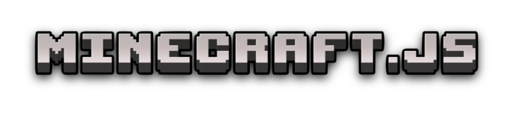
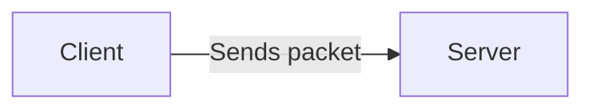
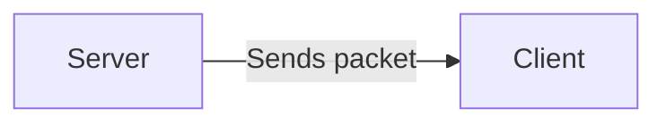

  

  
  
  
  

## Core

TODO:

## Protocol

This package contains content related to the [Minecraft Protocol](https://minecraft.wiki/w/Java_Edition_protocol), including packets and states. The protocol defines two types of packets: those sent by the client and those sent by the server.

#### Outbound Packets

These packets are initiated by the client and sent to the server. They include actions such as player movement, chat messages, and interactions with the game world. In the protocol wiki, they are referred to as `serverbound`, meaning they are bound for the server.

#### Inbound Packets

These packets are initiated by the server and sent to the client. They include updates such as world changes, player positions, and game events. In the protocol wiki, they are referred to as `clientbound`, meaning they are bound for the client.

